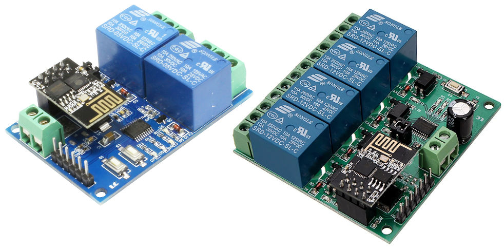

# RemoteRelay
RemoteRelay is an alternative ESP8266 firmware for the relay board made by LCTech-inc.

## The board

This board is a two-way relay over WiFi in a compact form factor and with a 3.3v onboard regulator to power the ESP8266.


See http://www.chinalctech.com/index.php?_m=mod_product&_a=view&p_id=1261

You can usually find this cheap device on any chinese electronics retailer.

## Why another firmware ?

This board is not using the ESP8266 to manage the relays but instead another onboard MCU. The ESP8266 module is just used as a WiFi interface with its default AT firmware. The two chips are using serial (115200-8-1) to communicate.

The original user experience is pretty clunky and no really usable. On power up, the board start an access point you need to connect your phone to in order to send commands. This is only usefull for testing as it's isolated from your main network.

To switch to station mode, you need to push a button on the board (S1), install an app on your phone and then use this app to feed your SSID and password to the board. The app will then display its IP.
Once connected, you need to send a binary payload over a plain TCP socket. No HTTP, no protocol of any kind, just plain binary.

For example, you can run this command from Linux to switch on the first relay :
```
echo -ne "\xA0\x01\x01\xA2" | nc 192.168.0.9 8080
```

There is no way to get a feedback of the current state of the relay (beside looking at the leds on the board).

On power loss, the board switch back to access point and you have to push the S1 button again to reconnect.

### We can do better

RemoteRelay is a replacement sketch to be loaded on the ESP8266. It provide a convenient configuration interface with a captive portal and a proper REST API over HTTP to control the relays. It also support authbasic authentication (but not https).
All configuration is saved to resume operation after a power loss without any action.

Note that the two button on the board are now useless.

## Tools installation

The compilation of this sketch require the Arduino IDE with the ESP8266 libraries.

Refer to the [Arduino core for ESP8266](https://github.com/esp8266/Arduino) for the installation steps.

You may also need the esptool CLI, available on [Espressif website](https://github.com/espressif/esptool).

## Firmware compilation and upload

First, the module need to be unplugged from the board and set up into the [flashing mode](docs/flashing-mode.jpg).

In the Arduino IDE, open the RemoteRelay sketch.

To install dependencies, go to 'Sketch' -> 'Include Library' -> 'Manage Library' and install this package :

 - WiFiManager

In the 'Tools' menu, select the board 'Generic ESP8266 board' and set these settings :

 - Flash mode : QIO
 - Flash frequency: 40 Mhz
 - CPU Frequency: 80 Mhz
 - Flash size :  1M (64K SPIFFS)

Then run 'Compile' and 'Upload'.

If the ESP8266 module is not plugged into the same computer, you can also use the following command to upload the compiled binary :

```
esptool.py --port /dev/ttyAMA0 write_flash -fm qio 0x00000 RemoteRelay.ino.generic.bin
```

You can then put the module back on the board.

## Debug and monitor serial output

Once the ESP8266 back on the board, you can listen to the UART for debugging by plugging your serial RX on the TX pin of the board. You will see the output of the RemoteRelay firmware. If you use a separate power supply for the board, don't forget to connect the ground together.

The serial communication must be set to `115200 8N1`. Any serial console software will do the job :


```
minicom -D /dev/ttyAMA0
```

Example of boot message :

```
[0.042] RemoteRelay version 1.0 started.
[0.042] Loaded settings from flash
[0.043] Channel 1 switched to off
[0.043] Channel 2 switched to off
[6.866] Connected. IP address: 192.168.1.4
[6.867] HTTP server started.
```

## First boot and configuration

On the first boot, the module will start an access point with a captive portal. Once you are connected to it you will be redirected to the configuration page to fill in the SSID and the key of your network. You can also specify here a login and password for the AuthBasic authentification (default no auth).

After validation of the form, the module will connect to your Wifi. Check your DHCP's logs to get the ip (or listen to the debug log on the serial port).
If the connection fails or if the password changes, the captive portal will be started again.

## Authentication

RemoteRelay support HTTP Auth Basic authentication (but not https).

By default, there is no login required. Everybody on your network will be able to control your relays.
To enable authentication, set the login and password during the first boot on the configuration web page. You can also set it later by updating both settings `login` and `password` :

```
curl -X POST 'http://192.168.1.4/settings?login=admin&password=mysecret'
```

All settings are stored into flash and are persistent upon reboot and power loss.

### How to reset credentials

If you loose the password, you can change it on the configuration web page. This page will be presented automatically at boot time if it cannot connect to the configured access point.

The second option is to use the reset endpoint :

```
curl -X POST 'http://192.168.1.4/reset'
```
This will erase all settings and reboot the module.

The last option is to completely wipe out the flash :

```
esptool.py --port /dev/ttyAMA0 erase_flash
```

You will need to re-upload the firmware after this operation.


## API definition

 - GET /channel/:id

Show the current status of the channel number :id. :id need to be either the value 1 or 2.

  * Return "application/json" :

```json
{
  "channel": "1",
  "mode": "off"
}
```

 - GET /settings

Show the current settings, as stored in flash. See `POST /settings` for details on each parameter.

  * Return "application/json" :

```json
{
  "login": "",
  "password": "<hidden>",
  "debug": false
}
```

 - GET /debug

Display device information and last 100 lines of the log. Can be quite verbose if debug mode is on.

   * Return "text/plain" :

```
 ==== DEBUG LOG ====
Chip ID: 9342529
Free Heap: 28080
Flash Size: 1048576
Uptime: 28:33:32
Printing last 100 lines of the log:
[0.042] RemoteRelay version 1.0 started.
[0.042] Loaded settings from flash
[0.043] Channel 1 switched to off
[0.043] Channel 2 switched to off
[6.866] Connected. IP address: 192.168.1.4
[6.867] HTTP server started.
[21.608] Channel 1 switched to off
[22.735] Channel 2 switched to on
 ==== END LOG ====
```

 - PUT /channel/:id

Switch on or off the channel number :id. This is volatile and won't be kept after a reboot. At boot time, the relays are turned off.

   * Parameters :

     - mode : *[on|off]*

  * Return :

Return the same information as  `GET /channel/:id`.

   * Example :

```
curl -X PUT -F "mode=off" http://192.168.1.4/channel/1
```

 - POST /settings

Update configuration settings. This is stored in flash and is kept after a power loss.

   * Parameters :

     - debug : *[bool]*		Turn on extra logging. (default false)
     - login : *[str]*		Auth Basic login. (default empty)
     - password : *[str]*	Auth Basic password. (default empty)

   * Return :

Return the same information as `GET /settings`.

   * Examples :

```
curl -X POST -F 'login=admin' -F 'password=mysecret' http://192.168.1.4/settings
curl -X POST -F 'debug=true' -u admin:mysecret http://192.168.1.4/settings
```

 - POST /reset

Erase both WiFi and AuthBasic settings and restart the module. USE WITH CAUTION: Some ESP8266 tend to crash after the reboot.

   * Return :

No return. The connection will be lost as the module is rebooting.

## License 

Copyleft 2018 - Nicolas AGIUS - GNU GPLv3

